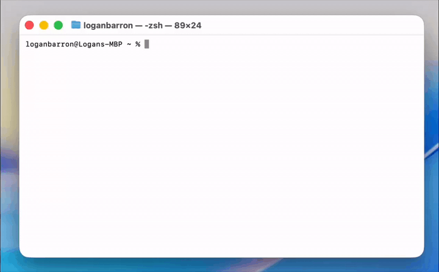

# updatett

A simple zsh script that updates terminal tools with a spinner UI and version tracking.


## Currently
Updates uv, Claude CLI, Codex, Wrangler, Stripe js. Shows before/after versions and skips tools that are already up to date. 

## Installation
Copy the updatett file to /usr/local/bin and make it executable:
```
cp updatett /usr/local/bin/updatett
chmod +x /usr/local/bin/updatett
```

## Running It
In Terminal - type: 
```
updatett
```

That's it. It runs through all configured tools and updates them.

## Updating The Script
Just copy it over the old one:
```
cp updatett /usr/local/bin/updatett
```

## Removing It
Delete the file from /usr/local/bin:
```
rm /usr/local/bin/updatett
```

## Adding Tools
Open the script and find the TOOLS array (around line 65).
Add a line in this format:
```
"Display Name|command_to_check|version_command|update_command"
```

Example: "GitHub CLI|gh|gh --version|gh upgrade"

If the tool doesn't have a CLI command (like npm packages), use SKIP_CHECK:
```
"My Package|SKIP_CHECK|npm list -g mypackage|npm install -g mypackage@latest"
```
